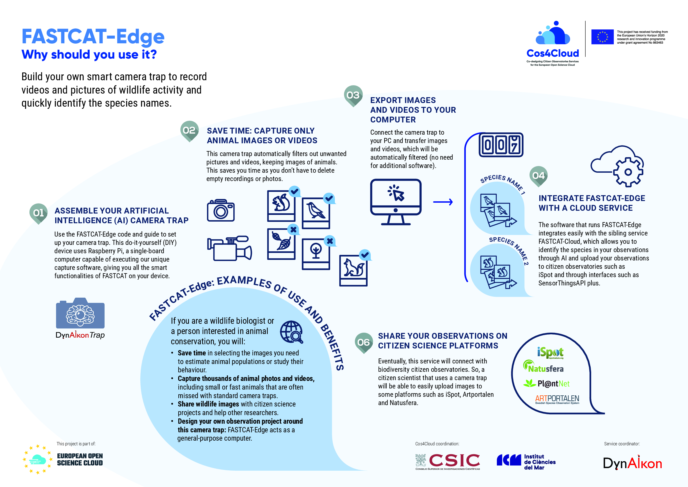

FASTCAT-Edge
============

This page explains DynAIkon's FASTCAT-Edge specification, and how this relates to DynAIkonTrap, our AI-capable camera trap. 

What is a Camera Trap?
______________________

A Camera Trap is a camera that is automatically triggered by changes in its
surrounding environment, for example an animal moving past the camera.

What is FASTCAT?
________________

FASTCAT is DynAIkon's specification for Flexible Ai SysTem for CAmera Traps. It comprises of a Cloud component and an Edge component. The specification for FASTCAT-Cloud describes a service that is centrally hosted to which a network of camera traps can connect, and upload their observations to get high precision species detections.

The FASTCAT-Edge specification describes an individual camera that performs
animal detection in real time at the edge. This can be standalone or a part of a network that pools all observations.

The corresponding FASTCAT-Cloud service on the web is described
`here  <https://cos4cloud-eosc.eu/services/fastcat-cloud-camera-trap>`_.

DynAIkonTrap as an instance of FASTCAT-Edge
___________________________________________

Whilst FASTCAT-Edge is a specification, DynAIkonTrap is an instance of the
specification. It combines all the necessary hardware and software to perform
observations at the Edge. Using the tree-bar on the left, you may browse the reminder of the documentation which forms a user guide for the DynAIkonTrap project. This is available as fully open sourced software which may be installed on a target Raspberry Pi device. 

DynAIkonTrap: Camera Trapping on the Raspberry Pi
-------------------------------------------------

*An AI-enabled camera trap design targeted at the* **Raspberry Pi platform**.

DynAIkonTrap makes use of a continuous stream from a camera attached to the
Raspberry Pi, analysing only the stream to detect animals. Animal detections can be used to save or send individual frames from the video, or even whole video segments. The beauty of this is that the system does not rely on any secondary sensors like PIR sensors and acts on exactly what the camera sees.

This project is part of the COS4Cloud research project funded by the EU.

See our coverage on COS4Cloud channels `here <https://cos4cloud-eosc.eu/services/fastcat-edge-camera-trap/>`_ and `here <https://cos4cloud-eosc.eu/blog/camera-trap-artificial-intelligence-species-automatic-identification-fastcat-edge-cloud/>`_ .

Acknowledgements
----------------

   programme under grant agreemant No 863463
