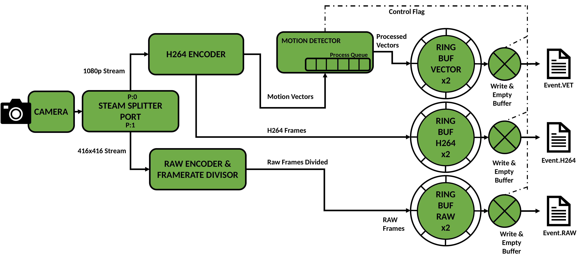

Low-powered Pipeline
--------------------

The low-powered pipeline has been built to design around RAM and processing constraints on lower-powered RPi platforms. This is achieved by buffering video in system RAM and saving events of motion to disk which are processed post-hoc. This documentation provides a breif overview of pipeline Stage One, which buffers video disk and Stage Two which loads motion events from disk and processes them.

Stage One
---------

The image below shows the architecture for Stage One. Data flows from the camera, is buffered in RAM and emptied to file if motion is detected. Captured files contain the video stream compressed in H264 format, motion vectors, and a stream of uncompressed images down-scaled to fit the input buffer for neural network inference.

Data begins its journey at the camera sensor. A splitter port software component is attached to the PiCamera abstraction of the RPi camera module, this splits data from the camera input into two synchronous outputs, P:0 and P:1.

Video streams are output to fixed-size ring buffers in system RAM. While motion is detected, the buffers are emptied to disk and three files are produced. Event.VET contains motion vectors for the motion event, Event.H264 contains the H264 stream of high-resolution encoded video, Event.RAW contains down-sampled and down-scaled raw image data for processing with a neural network. For a full buffer, I/O write access time can be much larger than the stream frame period. It is necessary to continue buffering frames while emptying buffered frames to disk. This has been accommodated for by creating an auxiliary ring buffer for each stream. When the signal is given to empty the buffer, the buffer to fill (the active buffer) is switched while the full (inactive) buffer is emptied. While the motion event continues, buffers are continually switched and emptied to disk when they fill up. The simplest scheme found to signal full buffers is to simply check the time since last emptied and empty all buffers again if over some threshold. This keeps all three streams synchronous on disk even though buffers may fill at different rates. In addition, buffering video on disk allows the output video to contain some extra “context” time before animal detection. The length of context time is also exposed as a user configurable setting accessibe via the tuning script. Context is also added as a trailing period after motion is finished.

The final component is the motion detector. A motion detection component has been built which makes use of two processes. One process adds incoming MVs from the H264 encoding process to a queue for processing with the motion detection algorithm. Another takes each motion vector frame and computes motion detection. The queue is required so that the stream does not stall if a small number of motion frames take longer than a frame interval for computation. So long as the average time to compute motion is less than a frame interval, the queue empties faster than it fills. If motion is detected, a flag variable is raised which triggers buffer emptying, this informs the remainder of DynAIkonTrap system that a motion event is being written to file.

Stage One is always running while DynAIkonTrap is activated, the addition of motion events to disk triggers pipeline Stage Two which runs neural network inference on detected video sequences.  

Stage Two
---------
Pipeline Stage Two reads motion events from file and determines animal presence in the captured video stream. This process may run in the background and unlike Stage One, it does not have strict real-time requirements. Parameters for this stage can be adjusted to suit computation availability on the deployed device. Trading inferences run for recall of animal events in nature. A flexible infernce scheme has been devised; a diagram of inference operation is shown below.

.. image:: ../../_static/stage-2.jpg
   :width: 800
   :alt: Stage Two Architecture

The image shows consecutive input frames in a detected motion clip loaded from disk. Shown is the proportion of frames which could contain an animal and the remaining frames which make up head and tail context. The spiral inference pattern is used to determine which clips do/no not contain animals. This works by first performing inference on the centre frame, if no animal is found the next inference is performed on an adjacent frame to the middle in a spiral pattern. If an animal is detected, the search is stopped and the whole clip is deemed interesting enough to warrant saving. The centre has been chosen as a starting point as this is judged to be the instance where the animal is most in-frame and thus easiest to detect.

To adjust number of inferences run, a step size can be set by varying the detector fraction, this is accessible via the tuning script. High step sizes allow fewer inferences to span across the video feed while low step sizes result in more inferences in the worst case which are closer packed together. The range of values for the detector fraction is given as (0, 1] and represents the fraction of the clip frames run with the detector in the worst case where no animals are found in any frames. There is also a special mode which runs one inference on the centre frame only, this can be configured by setting the detector fraction to 0 in the tuning script. 