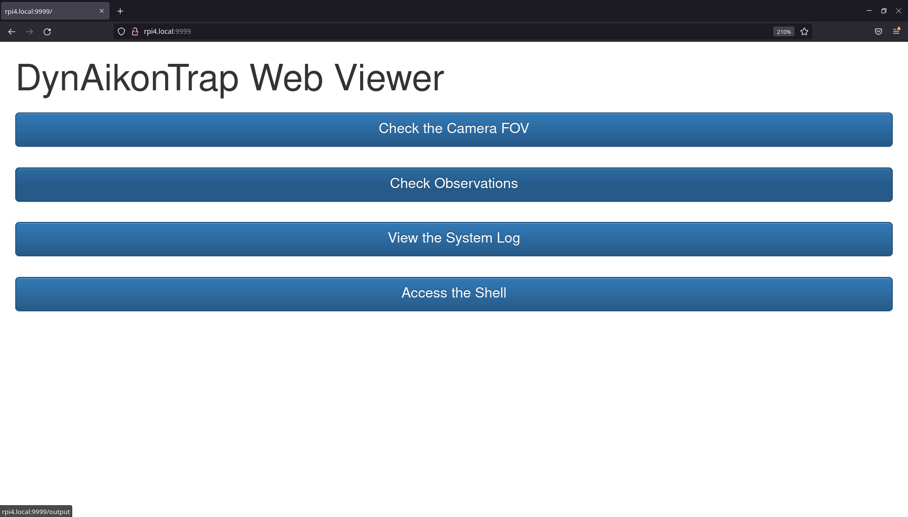

Web Viewer
**********

DynAIkonTrap web viewer is a HTTP server hosted on the device. This allows users
to check on detections made, the camera's field-of-view, the system log and even
access a system shell all from an external laptop or mobile phone.

The web viewer allows you to check on your DynAIkonTrap in the wild if you
provide a mobile hotspot connected to your DynAIkonTrap and your laptop/phone.

How Does It Work?
=================
The web viewer starts a HTTP server while DynAikonTrap is running on your RPi
(port 9999). If you have a Wifi connection to your Raspberry Pi and you know
it's IP address, then you can access the web-page and browse the features
available.

For information on how to find out your Raspberry Pi's IP address, see `here
<https://www.raspberrypi.org/documentation/remote-access/ip-address.md>`__.

To access the web server, simply open a web browser on a laptop of phone
connected to the same wifi network as the Raspberry Pi, and navigate to:

    .. code::

        http://<rpi-ip-address>:9999/

This will display the web-viewer's home page, as below.

Checking the Field of View
==========================

You can use the web viewer to check the camera's field-of-view, this is
especially useful when setting up the camera trap for the first time as it
allows you to check where the camera is pointing and to check on any focus
issues you may have.

To try this out, click the first button, labelled "Check the camera FOV". This
opens a new page, where an FOV snapshot is displayed as an image, you have an
option to refresh this to check a new field of view.

Checking Observations
=====================

You can also use the web viewer to check the observations made by the system
to-date. To do this, click on the second button labelled "Check Observations".
This will serve you a file browser where you can view the observations made and
sensor logs for each.

Checking the System Log
=======================

The system log shows camera trap activity and can be very useful in
troubleshooting or diagnosing system bugs. You can access the system log by
clicking the button labelled "View the System Log". This serves the log as a
text file rendered by your browser.

Access the Shell
================

One of the more powerful features of the web viewer is the ability to access a
shell terminal over a web browser. This is handy as it can allow you to
configure the system without opening a terminal-based ssh session. For example,
you could use the shell to run ``dyntrap-config`` to :doc:`configure system
settings <tuning>`.

To try this out, click the last button, labelled "Access the Shell". This opens
a new page where the

.. admonition:: Browser Support

    Some web browsers may not support this shell access. We reccomend you try
    using a `Firefox <https://www.mozilla.org/en-GB/firefox/new/>`_ browser if
    you are having issues with shell access.

Troubleshooting
===============

If you're having problems connecting to the web viewer here are a couple of
things to try:

    * Make sure your Raspberry Pi and the machine running the web browser are
      connected to the same network. If you're running a mobile hotspot, you can
      usually check which devices are connected to your hotspot in the settings
      (this can also be a quick way to find out the IP address of your Raspberry
      Pi!). For help setting up a new wifi network on a Raspberry Pi, see `here
      <https://www.raspberrypi.com/documentation/computers/configuration.html#configuring-networking>`__.

    * Remember, DynAIkonTrap must be running for the web server to start. If you
      just booted up the Raspberry Pi, you will need to start DynAIkonTrap for
      things to work. There are methods to force programs to start on-boot of
      the Raspberry Pi (see `here
      <https://raspberrytips.com/autostart-a-program-on-boot/>`__) and we hope to
      more streamlined support for this in the future.

